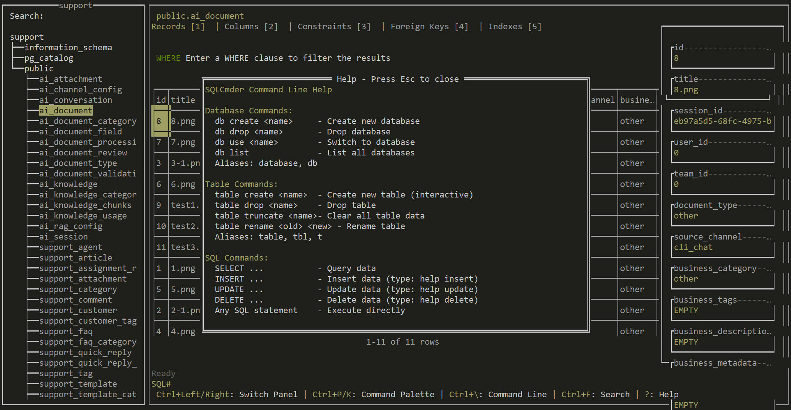

# SQLCmder

A cross-platform Terminal UI database management tool with built-in command line interface (CMDER), written in Go. Personally customized and enhanced based on LazySQL.



## ⚠️ Disclaimer

**THIS IS A BETA/TEST VERSION - NOT FOR PRODUCTION USE**

- This software is provided "AS IS" without warranty of any kind
- No guarantees of reliability, security, or data integrity
- Use at your own risk - the author assumes no liability for any damages
- Recommended for testing and development environments only
- Always backup your data before use

## Installation

### Build from Source (Recommended)

**Prerequisites:**
- Go 1.19 or higher
- Git

**All Platforms (Windows / Linux / macOS):**

```bash
# Clone the repository
git clone https://github.com/shangyanjin/sqlcmder.git
cd sqlcmder

# Build the application
go build -o sqlcmder

# Run the application
./sqlcmder
```

**For Windows:**
```powershell
# Build for Windows
go build -o sqlcmder.exe

# Run
.\sqlcmder.exe
```

## Features

### VI-Style Command Line (CMDER)
- Built-in command interpreter with `SQL#` prompt
- Quick database operations: `db create/drop/use/list/backup/import`
- Quick table operations: `table create/drop/truncate/rename`
- Database backup and import support (MySQL, PostgreSQL, SQLite, MSSQL)
- Direct SQL execution
- Command history navigation (Up/Down arrows)
- Comprehensive help system: `help <topic>`

### Database Support
- PostgreSQL
- MySQL
- SQLite
- SQL Server

### User Interface
- Clean TUI with keyboard navigation
- Connection management with presets
- Real-time query results
- Split-panel layout (database tree + results + sidebar)
- Syntax-aware SQL editor

## Quick Start

```bash
# Run the application
./sqlcmder

# Connect to database
# Use connection form or command line

# In command line (Ctrl+\)
SQL# db list                    # List databases
SQL# db use mydb                # Switch database
SQL# SELECT * FROM users;       # Execute SQL
SQL# db backup mydb_backup.sql  # Backup database
SQL# db import mydb_backup.sql  # Import from backup
SQL# help insert                # Get SQL syntax help
```

## Keyboard Shortcuts

### Global Shortcuts
| Key | Action |
|-----|--------|
| `q` | Quit application |
| `Ctrl+E` | Open SQL editor |
| `Backspace` | Return to connection selection |
| `?` | Show keybindings popup |
| `Ctrl+\` | Search tree |
| `Ctrl+Left/Right` | Switch panels |

### Table Operations
| Key | Action |
|-----|--------|
| `c` | Edit table cell |
| `d` | Delete row |
| `o` | Add row |
| `/` | Focus the filter input or SQL editor |
| `Ctrl+S` | Commit changes |
| `>` | Next page |
| `<` | Previous page |
| `K` | Sort ASC |
| `J` | Sort DESC |
| `H` | Focus tree panel |
| `Ctrl+[` | Focus previous tab |
| `Ctrl+]` | Focus next tab |
| `X` | Close current tab |
| `R` | Refresh the current table |

### Tree Navigation
| Key | Action |
|-----|--------|
| `L` | Focus table panel |
| `G` | Focus last database tree node |
| `g` | Focus first database tree node |
| `Ctrl+U` | Scroll 5 items up |
| `Ctrl+D` | Scroll 5 items down |

### SQL Editor
| Key | Action |
|-----|--------|
| `Ctrl+R` | Run the SQL statement |
| `Ctrl+Space` | Open external editor (Linux/macOS only) |
| `Esc` | Unfocus editor |

## Backup & Import

SQLCmder supports database backup and import operations:

### Backup
```bash
SQL# db backup mydb_backup.sql
```
- Backups are saved to `./backup/` directory
- MySQL/PostgreSQL require CLI tools (`mysqldump`, `pg_dump`)
- SQLite uses direct file copy
- MSSQL requires `sqlcmd` tool

### Import
```bash
SQL# db import mydb_backup.sql
```
- Looks for files in current directory or `./backup/`
- MySQL/PostgreSQL require CLI tools (`mysql`, `psql`)
- SQLite executes SQL statements directly
- MSSQL requires `sqlcmd` tool

### Requirements
- **MySQL**: Install MySQL client tools
- **PostgreSQL**: Install PostgreSQL client tools
- **SQLite**: Built-in support (no external tools needed)
- **MSSQL**: Install SQL Server command-line tools

## Configuration

Config file location: `./config.toml` (next to executable)

## Project Structure

```
sqlcmder/
├── cmd/
│   └── sqlcmder/                 # Entry point (main.go)
│
├── internal/
│   ├── tui/                      # Terminal UI components (bubbletea, tview, etc.)
│   ├── commands/                 # Command handler (query, export, import, etc.)
│   ├── db/                       # Database driver layer (pgsql/mysql/sqlite)
│   ├── config/                   # Config system (TOML/YAML/ENV)
│   ├── model/                    # Shared structs (DB config, query result, etc.)
│   ├── logger/                   # Logging system (zap/logrus/custom)
│   ├── utils/                    # Common helpers (string, file, env, time, etc.)
│   └── backup/                   # Database backup & restore logic
│
├── scripts/                      # Utility scripts (build, release, clean, test)
│   ├── build.sh                  # Cross-compile script for Linux/Mac/Win
│   ├── release.ps1               # Windows build + zip packaging
│   ├── backup_db.sh              # CLI database backup helper
│   └── init_config.ps1           # Generate default config for Windows
│
├── docs/                         # Documentation
│   ├── README.md                 # Main project doc
│   ├── CONFIG.md                 # Config format & examples
│   ├── COMMANDS.md               # CLI usage reference
│   ├── DB_SUPPORT.md             # Supported databases and drivers
│   └── DEV_GUIDE.md              # Developer contribution guide
│
├── tmp/                          # Temp files (session cache, query history)
│   ├── logs/                     # Runtime logs (if not system log)
│   └── query_cache/              # Cached query results (optional)
│
├── backup/                       # Auto or manual database backups
│   ├── pgsql/                    # PostgreSQL dumps
│   ├── mysql/                    # MySQL dumps
│   └── sqlite/                   # SQLite copies
│
├── examples/                     # Example config & query templates
│   ├── sample_config.toml
│   └── example_queries.sql
│
├── .env                          # Environment variables (optional)
├── .gitignore
├── go.mod
└── go.sum
```

## Credits

Based on [LazySQL](https://github.com/jorgerojas26/sqlcmder) by Jorge Rojas.

## License

MIT License
